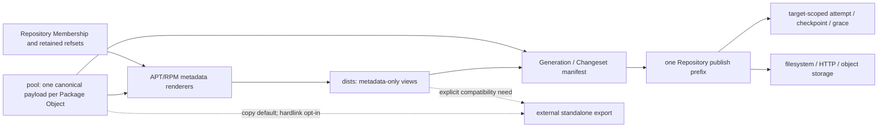

# Architecture Spine — SOW Repository-scoped single-payload projection

## Design Paradigm

Archive-root shared-payload projection：Repository root 同时是本地静态树、relocation
unit 与 publish prefix root；`pool/` 是唯一 package payload data plane，`dists/`
是 metadata-only projection plane。协议 metadata 通过可验证的相对引用连接二者。

本 Spine 已落入当前 0.3 源码，并有本地 unit/fault/mock verification。AD 仍是实现
必须满足的决定；本地测试只能证明实现层，不能把真实客户端、HTTP/proxy、第三方工具或
真实 R2 compatibility 写成 PASS。

## Inherited Invariants

| Inherited | From parent | Binds here |
| --- | --- | --- |
| AD-3 fixed ownership | v0.2 spine | Workspace/Repository/Dist/View ownership；Repository 继续拥有自己的 pool、dists、DB 与 private state |
| AD-4 root-bound paths | v0.2 spine | filesystem mutation、href round-trip 与 delete containment |
| AD-8 parser/renderer ports | v0.2 spine | package facts 与 caller-owned location policy 分离 |
| AD-9 pointer-last commits | v0.2 spine | package、metadata、pointer 与 grace/delete 顺序 |
| AD-11 canonical architecture | v0.2 spine | native 与 neutral projection，不为 noarch/all 建新 payload identity |
| AD-15 operational envelope | v0.2 spine | local single-writer transaction；remote publication 不改变 local owner |
| GenerationFile/Changeset wire | v0.2 state | target-neutral path/phase/size/SHA manifest、canonical digest 与 exact delta |

## Invariants & Rules

### AD-13 — Root Pool with computed parent-relative RPM href [ADOPTED; supersedes v0.2 rule]

- **Binds:** CAP-1, CAP-3, RPM renderer/checker/migration
- **Prevents:** 为默认 reposync 重建 view-local package aliases，或把 href 深度/部署域名写死
- **Rule:** root `pool/...` 是 RPM 的唯一 payload path；每个 architecture view 只拥有 repodata，renderer 从实际 Repository-relative view root 与 canonical Pool path 计算 POSIX parent-relative href，并 round-trip 验证恰好解析回该 Pool path。禁止 canonical per-view package hardlink、symlink、copy alias。

### AD-17 — Repository/publish-prefix deduplication boundary [ADOPTED]

- **Binds:** CAP-1, CAP-4, CAP-5, state, publish, GC
- **Prevents:** 一个实现按 Repository 去重、另一个擅自引入 workspace/bucket-global CAS 与跨仓锁
- **Rule:** Package Object、Desired/Built、Generation、Changeset 与 local GC 是 Repository-scoped、target-neutral；Publication Attempt、Applied Checkpoint、remote inventory/grace/delete evidence 是 Repository + target publish prefix scoped。每个 live Package Object 与 Pool path 双向唯一；每个 prefix 内一个 payload key，不承诺跨 Repository/prefix 去重。

### AD-18 — Canonical tree maps one-to-one to static object keys [ADOPTED]

- **Binds:** CAP-1, CAP-4, filesystem handoff, object storage
- **Prevents:** hardlink 在上传时展开成重复 keys，或 publication 依赖隐式 URL router
- **Rule:** canonical public tree 只有 `pool/ + dists/`；publish manifest 把每个规范化 Repository-relative regular-file path 一对一映射到 prefix 下同名 key。metadata href 不是 key。edge rewrite、redirect object、absolute `xml:base` 和 target-global object namespace 都不是正确性依赖。HTTP/proxy/object compatibility remains unverified until live target evidence exists.

### AD-19 — Repository root is the handoff and security unit [ADOPTED]

- **Binds:** CAP-2, CAP-3, CAP-7, relocation, mirroring, auth
- **Prevents:** 把一个 architecture leaf 误当 standalone，或只保护 `dists/` 而泄漏 `pool/`
- **Rule:** DNF/APT client entry 是各自 protocol view/archive base；完整 Repository root 才是受支持的 locked handoff、relocation、storage 与 authorization unit。copy/ACL 保留 enclosing `pool/ + dists/` relationship 并保护整个 prefix；不得把 root 误写成含 `repodata/` 的 DNF baseurl。

### AD-20 — Package hardlinks are never canonical state [ADOPTED]

- **Binds:** CAP-1, CAP-6, local filesystem, checker
- **Prevents:** POSIX inode optimization成为对象存储正确性、跨设备要求或可变 alias 风险
- **Rule:** package correctness uses path, size, digest, identity and reference closure only. Hardlinks are allowed only for private transaction recovery, APT by-hash metadata, or `sow-rpm-leaf-v1` external export. Export defaults to copy; hardlink mode requires same filesystem and a trusted read-only operator boundary, explicitly exits hostile-writer/independent-integrity guarantees, and never makes link count canonical state.

### AD-21 — Retention is reference-based, not payload-copy-based [ADOPTED]

- **Binds:** CAP-4, CAP-5, Generation, snapshot-like views, GC
- **Prevents:** 每个 generation/snapshot 复制 packages，或按当前 Dist 局部引用误删共享 Pool
- **Rule:** every retained point stores exact metadata bytes/identity plus canonical payload refset in private Repository state; public snapshot-like views contain metadata only. Local GC and each target's remote GC compute their separately owned current/retained/snapshot/recovery/publication/grace closure and ignore inode link count; payload deletion requires target-bound evidence and atomic conditional delete. Targets without that primitive retain and report unreachable keys rather than deleting.

### AD-22 — Reposync compatibility is an external projection [ADOPTED]

- **Binds:** CAP-3, CAP-6, CAP-7, CLI/export
- **Prevents:** 为一个镜像命令削弱 canonical layout，或把 community opt-in 当 EL 默认合同
- **Rule:** default EL reposync is outside the product contract for parent-relative href; only pinned AlmaLinux 9 rejection is currently evidenced and other clients remain matrix cells. `--safe-write-path` is unverified best-effort only. The implemented self-contained leaf uses external `sow-rpm-leaf-v1`, regenerated leaf-local metadata and a completion marker; it is not a Generation, Changeset, publish source, membership owner, or GC root. A real default-reposync positive remains required before calling the export a verified fallback.

### AD-23 — Publication is payload-first and pointer-last [ADOPTED]

- **Binds:** CAP-4, CAP-5, local/remote handoff
- **Prevents:** 新 metadata 引用缺失 payload，或 pointer flip 后立即删除旧客户端仍需对象
- **Rule:** Repository Built Generation is target-neutral. Each target persists an exact Publication Attempt; before the first mutable APT stable alias or protocol pointer write it records forward-only commit intent, then rolls protocol views forward with expected-remote CAS, verifies all views, advances Applied Checkpoint, retains per-target grace, and conditionally evidence-deletes only when the target supplies the required primitive. Before commit intent an exact reconcile may abandon the attempt without remote copy/delete, retaining only add-only object evidence for reuse; afterward recovery is forward-only. A configured target with an Applied Checkpoint fences withdrawal of its published pointer set until the binding is explicitly retired. Direct static publication permits a bounded mixed-view generation window and never claims multi-key atomicity. A payload path appears at most once in a manifest phase.

### AD-24 — Compatibility claims are evidence-layered [ADOPTED]

- **Binds:** CAP-2, CAP-3, CAP-6, CAP-7, acceptance
- **Prevents:** 从一个 EL9/file PoC 外推所有 DNF、proxy、object store 或 mirror tools
- **Rule:** report protocol expression, ordinary package-client consumption, mirror-tool behavior, static-target behavior and export behavior as separate matrix cells. `check` proves href resolution/digest/closure; only retained live-client/target evidence proves compatibility. Approved requirement, implemented, verified, unsupported and unverified are distinct states; unverified remains unverified.

### AD-25 — Repository identity and publish authority are explicit [ADOPTED]

- **Binds:** CAP-1, CAP-4, publish, restore, relocation
- **Prevents:** one workspace accidentally overlapping prefixes, a workspace copy silently taking publish authority, or a direct-static implementation pretending it has distributed prefix arbitration
- **Rule:** each Repository owns a persistent UUID independent of name/path. Target storage identity excludes prefix; target identity adds one canonical prefix. One Workspace registry rejects same/ancestor/descendant prefixes, while supported remote operation requires an authoritative single writer and exclusive write authority over the containing storage namespace; a provider without prefix-scoped credentials requires a dedicated bucket or one Workspace-owned bucket. Canonical state adds no target-global owner registry: independent workspaces/out-of-band writers are unsupported, exact-object CAS detects unexpected mutation, and missing binding/checkpoint permits read-only reconcile only. Relocation/restore preserves ID; explicit fork creates a new ID without target authority.

### AD-26 — Public paths have typed, format-specific encoding [ADOPTED]

- **Binds:** CAP-1, CAP-2, CAP-3, renderer/checker/object mapping
- **Prevents:** `%2F`/`%25` double decode, no-trailing-slash base divergence, or different Pool shards across implementations
- **Rule:** `sow-managed-pool-v1` fixes ASCII component grammar and the lowercase first-or-`lib*` shard. APT serializes the exact canonical Pool path in `Filename`; DEB basenames accept only ordinary safe bytes plus literal `%3a`/`%3A`, and URI construction—not the Packages renderer—encodes `%` as `%25`. RPM resolver accepts unescaped canonical paths, computes literal parent navigation, percent-encodes every non-unreserved data byte with uppercase hex, then XML-escapes; view base is a trailing-slash directory URI and round-trip decode-once must equal the canonical Pool path.

### AD-27 — Transitional inventories cannot masquerade as Generations [ADOPTED]

- **Binds:** CAP-4, migration, changes, recovery
- **Prevents:** `changes --base 0` excluding live C2 aliases while claiming exact physical-tree identity
- **Rule:** next Built Generation/Changeset exactly describes a terminal steady public tree. Layout migration uses a separate versioned transition journal and legacy inventory; ordinary changes/publish/GC fail closed until aliases are receipt-deleted and a final next Generation is atomically committed. Commit-intent makes automatic recovery forward-only.

## Consistency Conventions

| Concern | Convention |
| --- | --- |
| Public paths | Repository-relative POSIX paths; `/` separator; canonical Pool paths contain no dot segments |
| Identity | persistent Repository UUID + target storage ID + canonical prefix; local overlap rejection and exclusive storage write authority |
| APT path | `Filename` is exact canonical Pool path, not a URI; URI layer encodes once and resolves back to the same path |
| RPM href | versioned `(directoryBaseURI, viewRoot, poolPath) -> href`; uppercase percent encoding; checker reuses and round-trips decode-once |
| Manifest | normalized physical paths only; href/xml:base never serialized as object keys |
| Local/remote state | Built Generation target-neutral; Publication Attempt/Checkpoint/grace target-scoped |
| Mutation | lock → recover → stage/validate → create-only payload/immutable metadata → commit-intent → mutable APT aliases/per-view pointer roll-forward → verify/checkpoint → grace → conditional delete when supported, otherwise retain/report |
| Integrity | size + SHA-256 + package identity + membership/ref closure; never inode/link count |
| Compatibility | required, best-effort, unsupported and unverified are distinct states |

## Structural Seed



```text
<workspace>/<repo>/
  pool/    # canonical payload data plane
  dists/   # metadata-only projection plane
```

## Capability → Architecture Map

| Capability / Area | Lives in | Governed by |
| --- | --- | --- |
| CAP-1 single payload | Repository pool/state/renderer | AD-13, AD-17, AD-18, AD-20, AD-25, AD-26 |
| CAP-2 APT | APT renderer/checker | AD-17, AD-19, AD-23, AD-24, AD-26 |
| CAP-3 ordinary DNF | RPM renderer/href resolver/checker | AD-13, AD-19, AD-24, AD-26 |
| CAP-4 Generation/Changes/publish | Generation ledger, manifest, handoff | AD-17, AD-18, AD-23, AD-25, AD-27 |
| CAP-5 retention/GC | retained refsets and Repository/target GC | AD-17, AD-21, AD-23, AD-25 |
| CAP-6 compatibility export | external export application | AD-20, AD-22 |
| CAP-7 verification | check + compatibility matrix | AD-19, AD-24, AD-26 |

## Deferred

- Snapshot/channel CLI 与命名；前置不变量是 exact metadata/refset only，且不新增 payload alias。Generation/refset identity 与 retention owner 不再 deferred。
- 第三方 repository manager 的逐产品适配；有实际目标时加入矩阵，失败走 export。
- 跨 Repository/prefix 去重；只有用户重新定义去重、安全与事务边界时才重开。
- R2 之外的供应商 adapter、未来显式 state export/import/adoption 与 CDN 实现；不得改变
  已实现的 private checkpoint/attempt/grace owner 或 `state-publication.md` 的 single-writer/
  prefix-exclusive authority、per-view roll-forward、Applied Checkpoint、grace 和 deletion
  preconditions。
