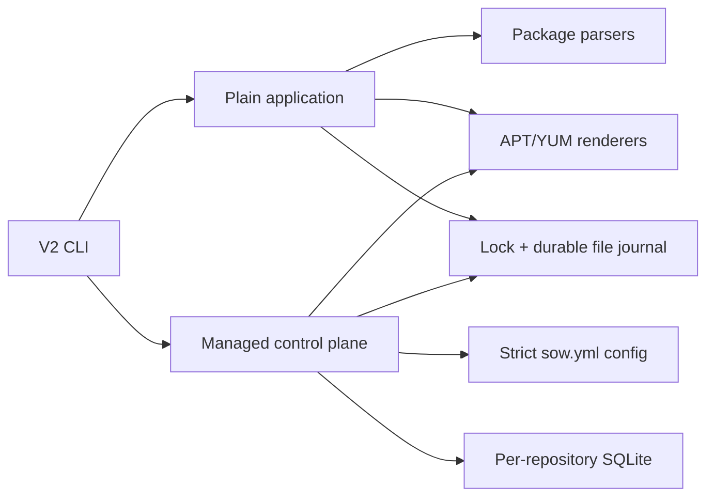

# SOW V2 P0–P3 实现架构

状态：当前实现说明（2026-08-02；最终验收结果另见 P1–P3 evidence）
范围：P0 Plain Create、P1 Managed Control Plane、P2 Mutation/Recovery、P3 Verification/Handoff
范式：纯本地、单机单写的事务式仓库引擎；Plain 与 Managed 为隔离的两条运行路径

## 1. 规范基线

| 优先级 | 文件 | SHA-256 |
| --- | --- | --- |
| 1 | `api-contract.md` | `e20d72204647e481fa869cc1b0fa6790de246fdab1b28284487184bca2f2f019` |
| 2 | `prd.md` | `f8d4d8fabf46c595706f905c0c9d4df19427c247ce1a046af40e31ea019a4a57` |
| 3 | `addendum.md` | `7e40308b78b879fa1893c8ccaba3856b296e6b3bf0d91db158782fa803056270` |

命令、参数、默认值、输出、状态和退出码由 API 契约决定。canonical SPEC/acceptance matrix 固定 P1–P3 能力与验收结果，PRD 和附录提供来源追踪。V1 源码和测试仅是可复用资产证据。

本实现没有 Git 正典、CAS 产品层、远端状态、对象存储、CDN、Route、View、Snapshot 或发布 saga。

## 2. 边界与所有权

```text
Workspace                         Plain directory
├── sow.yml                       ├── *.rpm / *.deb   caller-owned
├── .sow/                         ├── repodata/       SOW-owned index
│   ├── workspace.lock            ├── Packages{,.gz} SOW-owned index
│   ├── workspace-ops/           └── transient file journal
│   │   └── [active.json]
│   ├── repo-locks/<repo>.lock
│   ├── <repo>.db
│   └── <repo>/
│       ├── stage/
│       ├── recovery/
│       └── pending/
└── <repo>/
    ├── pool/                     Repository-owned immutable package bytes
    └── dists/
        └── <dist>/               one format, mutable named membership set
            └── architecture view rendered from membership
```

- Workspace 是发现与配置边界，只拥有根级 `sow.yml` 和 `.sow/`。
- Repository 固定为 `<workspace>/<repo-name>`，拥有自己的 `pool/`、`dists/`、SQLite、锁和恢复状态。不同 Repository 不去重。
- Dist 是单一 `rpm` 或 `deb` 格式的普通具名集合；名称不产生 beta/prod/snapshot 状态机。P1 管理生命周期，P2 的 Desired Membership 与 P3 的 Built projection 仍共享同一 Dist 身份。
- Architecture View 是 Dist 的渲染投影，不建立额外 Membership。`noarch/all` 是 neutral projection，不是第三个 CPU family；build 将 native 与 neutral Membership 投影到每个适用 view。
- Plain 目录不是 Workspace；`sow create` 不读 `sow.yml`、不做发现、不创建 SQLite。

## 3. 两条隔离运行路径



Plain application 不得依赖 Managed config、Workspace discovery 或 SQLite。Managed control plane 不得把 Plain 顶层目录当作 Repository，也不得调用任何 V1 Git/CAS/publish 流程。两条路径只共享有窄输入输出契约的解析器、renderer、版本比较、锁和安全文件原语。

## 4. 固定布局与路径安全

Managed 路径只能由已解析的真实 Workspace 根、已校验名称和固定相对片段导出：

```text
<workspace>/sow.yml
<workspace>/.sow/<repo>.db
<workspace>/.sow/workspace.lock
<workspace>/.sow/workspace-ops/[active.json]
<workspace>/.sow/repo-locks/<repo>.lock
<workspace>/.sow/<repo>/{stage,recovery}
<workspace>/<repo>/{pool,dists}
<workspace>/<repo>/dists/<dist>/...
```

Repository/Dist 名称必须匹配 `[a-z0-9][a-z0-9._-]*`，并拒绝 `.`, `..`, `.sow`, `pool`, `dists` 及 Workspace 保留名。所有创建、rename 和删除操作必须：

1. 把 Workspace 根解析为绝对真实路径；
2. 以固定相对路径重新构造目标，验证 `filepath.Rel` 不含逃逸；
3. 对路径的已有每个受控组件使用 `Lstat`，拒绝 symlink 和非预期类型；
4. 只删除已先原子移入 `.sow/.../recovery` 或 Plain recovery trash 的对象；
5. 删除前再次证明 recovery 目标位于对应私有状态目录。

开发、故障注入和性能实验只使用 `/Users/vonng/repo` 下的显式测试目录或 `mktemp` 目录。`/Users/vonng/pgsty/repo` 只能做扫描、统计与少量样本复制源。

## 5. 锁与等待语义

Managed 生命周期与状态读写使用本机 POSIX advisory `flock`：

- Plain：先锁目标目录的稳定父目录，再锁目标目录自身；打开后用 `Lstat`/`fstat`/`SameFile` 绑定两个 inode，并在扫描、stage 和 journal 持久化后复核目标绑定。目标是文件系统根、父/目标为同一 inode 时只取得一次 `flock`，避免自锁；其他目录取得两把锁。父锁阻止另一个协作写者在目录被 rename 替换后取得“新目录”的独立锁；锁边界是一轮完整 create/recovery。
- Workspace 生命周期：`.sow/workspace.lock`。
- Repository 内生命周期：`.sow/repo-locks/<repo>.lock`；锁 inode 不随 `.sow/<repo>/` 私有状态移动或删除。
- 同时需要 Workspace 与 Repository 锁时，顺序固定为 Workspace 后 Repository，释放顺序相反。

组合读取 config、SQLite 与 live metadata 的 `config check`、`repo ls/show`、`dist ls/show` 固定取得 Workspace shared lock，再按稳定 Repository 名称取得所需 shared lock，并在整个命令快照期间持有。写者使用同一 inode 的 exclusive lock、`PERSIST_WAL=1` 与显式 checkpoint：所有已提交 frame 在返回前进入 main DB，但安全的 regular `-wal/-shm` 协调文件会跨连接保留。读者以 `mode=ro`、`query_only=1` 和有界 busy retry 打开真实 WAL snapshot；它可以更新 `-shm` 的 SQLite read mark，但不得改变 main DB、WAL、配置、journal 或公开仓库，所以 `-shm` 协调字节不属于产品状态。`status` 对当前持久 WAL 仓库只探测 Repository lock，写入期间仍可观察 recovering/locked；仅对历史 sidecar-free settled DB 在整个 immutable read 期间取得一次 shared Repository lock，避免第一个新版 writer 在 immutable reader 下 checkpoint。若写者在 COMMIT 与显式 checkpoint 之间终止，只有已存在、regular 且非空的 `-shm` 可用时，纯读面才打开非空 hot WAL，并把非终态 Operation 报为 recovering；hot WAL 缺失可用 `-shm` 时返回完整性错误，不得为读取创建 sidecar。后续生命周期写命令可在 Repository exclusive lock 内由 SQLite 重建持久 sidecar、读取已提交 WAL、恢复 journal 并 checkpoint。`config show` 只读取一次原子替换的 `sow.yml`：CLI 的多个 `-d` 投影全部从这一次已解析 config 派生，不组合 SQLite，所以无需读锁。

常规 shared/exclusive lock 都只能打开已初始化的 regular lock file，绝不使用 `O_CREATE`；缺失、symlink、类型变化或打开后 inode 与路径不一致都是完整性错误。只有首次 `init` 面对空 `.sow/`，以及持 Workspace EX 且有 durable `repo.init/repo.new` journal 的 Repository shell 创建，才有权以 `O_EXCL` 建立新 lock inode。这样 repo removal 可以在仍持有旧 fd 时撤下 lock path，而其他进程不能在新 inode 上形成 ABA 双写。

`--timeout/-T 0` 一直等待；正 Go duration 到期返回 4；`--no-wait/-N` 立即尝试并在冲突时返回 4；`--no-wait` 与非零 timeout 是 usage error 2。公共参数矩阵把它们暴露给 `create`、`repo new/rm`、`dist new/rm`、`add/rm/build` 和 `log prune`；`init` 内部仍取锁，但公共 CLI 只接受 `[DIR]` 与 `--json`。只读命令不取得写锁，也不接受锁参数。

## 6. 三类 Operation Journal

### 6.1 Plain durable file journal

Plain journal 固定为目标目录中的 `.sow-plain-operation.json`。当前 wire version 是 5，顶层封闭字段为 `version`、`pigsty`、`sign_with`、`overwrite`、`stage`、`trash`、`inputs`、`actions`、`dirs`、`next`：

- `inputs` 按 basename 稳定排序，绑定 format、basename、逻辑坐标、最终 SHA-256、可选原始 SHA-256、name、version、arch、是否签名和是否应清理；恢复前重新解析包头并核对原/新合法状态。
- `actions` 是完整有序的 `install|move` 计划，每项只使用 root-relative source/target、预期 SHA-256、replace 标志和可选故障点。每个 `install` 还绑定旧 live target 的 `prior`：是否存在、SHA-256、完整 mode、UID、GID，以及同文件系统 recovery trash 内的 durable pre-image 路径；`move` 不得携带 `prior`。
- `dirs` 只在 RPM install plan 中出现，并精确绑定操作前 `repodata/` 是否存在。普通失败 rollback 只删除本次创建且恢复后为空的目录；预先存在的空目录必须保留。
- `next` 是已完成 action 的持久提示；恢复仍以受绑定输入与 source/target 哈希证据判定，不盲信该数字。

stage、recovery trash、旧 live pre-image 与 journal 都在目标根同一文件系统内。metadata pre-image 先复制，待替换 RPM pre-image 使用同 inode 硬链接；两者都先哈希并 fsync 目录项，之后才允许 journal 以 temp → file fsync → rename → parent fsync 变为可见。journal 通过 no-follow、descriptor-bound 的 regular-file handle 在 64 MiB 上限内读取，避免 `Lstat` 后路径换绑；静态 wire/plan 校验与 live package 全量重验分离，action 前进只做 O(1) 计划校验，公开提交前才做一次完整 live 校验。未知字段/版本/action、路径逃逸、symlink 换绑、输入变化、pre-image 缺失或哈希矛盾均是完整性错误 5。

`--pigsty` 顺序固定为：

```text
scan/parse/hash
  → stage and validate optional RPM signatures and both formats
  → persist journal
  → withdraw old marker
  → replace each signed RPM from its staged final bytes
  → install RPM immutable metadata
  → atomically replace repomd.xml
  → atomically replace Packages and Packages.gz
  → rename each selected package to recovery trash
  → atomically replace new marker
  → fsync
  → delete trash and journal
```

新索引在包 recovery rename 前已经不引用清理集，签名操作的 package install action 则绑定原/新 SHA-256 和硬链接 pre-image。在 journal 持久化之前的错误不进入公开提交窗口。journal 持久化后的普通返回错误先在当前进程中撤销 fault hook，并同步 **roll-forward** 同一 durable plan：若完整新状态已耐久，则先验证并 fsync 所有公开 target、把 `next=len(actions)` 作为 committed cleanup hint 持久化，再返回成功；私有 cleanup 当次失败时保留该 completed journal，下次只验证公开新状态并重试 cleanup，绝不重放 action 或把正确的新 marker 误报成失败。若持续错误仍阻断完整新状态，则按 action 逆序用 durable pre-image、directory pre-image 和 recovery rename 恢复完整旧状态，验证后清理 journal/stage/trash，再把错误返回调用者。若 rollback 自身也失败，journal 与证据保留并闭锁为错误，不能假装旧状态已恢复。真正的进程终止不会走普通错误 rollback，而由下次使用完全相同的 Pigsty/签名授权幂等 forward-complete；证据冲突返回 5。故障点覆盖 journal、marker、每个签名 RPM replacement、RPM pointer 前后、DEB pointer 前后、每个清理 package rename、新 marker 前后。

### 6.2 Workspace file journal

`workspace.init`、`repo.init`、`repo.new`、`repo.rm` 共用单个 `.sow/workspace-ops/active.json`。Workspace lock 保证同时只有一条 active operation。封闭 wire 保存 `version`、随机 64-hex `id`、`kind`、`repository`、old/new `sow.yml` 原始字节与各自 SHA-256，以及 `planned|applied` phase；不保存可自由指定的路径。`workspace.init` 另外强绑定默认 config 字节。

`sow.yml` 原子 rename 是 `repo.new/rm` 的 forward commit decision：当前 config 仍匹配 old hash 时清理 planned journal 并回滚；匹配 new hash 时幂等补齐固定 Repository shell 或将自有对象移入 `.sow/workspace-ops/recovery-<id>/` 后清理。哈希不匹配任一边则拒绝猜测。

### 6.3 Repository SQLite Operation Journal

`dist.new`、`dist.init` 与 `dist.rm` 在任何公开 Dist 文件副作用前提交 `planned` Operation；随后记录 `staged`、`applied`、`built`、`done` 或 `rolled_back`。版本化 lifecycle payload 保存 Repository/Dist/format/architecture/generation、old/new config SHA-256、new config 字节以及 stage/live tree 哈希等恢复证据。未知 kind（包括未实现的 `dist.arch.add`）在执行 payload 前以完整性错误拒绝。

P2/P3 的 `add`、`rm`、`build` 使用 mutation wire version 2。Operation payload 绑定 Repository、config SHA-256、完整选择 Dist 集、精确 `build_dists`、`--skip`/no-op 决策与 versioned manifest SHA-256；manifest 绑定新对象 facts、完整 Desired 集合、逐 Dist policy outcome、确切 RPM 公钥证书快照，以及可选 generation/base manifest/每 Dist tree digest/metadata signer identity/promotion 集。公钥快照与 Desired mutation 或 Build finalization 在同一 SQLite transaction 留存，失败 Operation 不产生未记账的 verifier cache 副作用。需要立即 build 的 mutation 在 Desired Apply 前冻结 publication time、RPM package signer、RPM/DEB metadata signer、effective config、下一 Generation 与当前公开 base manifest，并按完整候选 Desired 集投影最终 recovery manifest；只有 base 与最终 manifest 都能被同一 reader 上限重新读回时才允许 Apply。显式 `build` 与 `rm` 在创建 Operation 前完成该门禁；`add` 因 API 要求先保留 planned 审计 Operation，但超限时只终结为 `failed`，不得写 package object、Membership、证书、Desired/Built、公开树或 stage 残留。`log.prune` 也使用 durable Operation，四个阶段都可由下一写命令恢复。所有非终态 Operation 都先于新的 Repository mutation 恢复；证据不一致返回 5，不猜测重建。

API §10.1 要求 `planned` Operation 先于包解析，因此“未知/未许可架构在状态写入前拒绝”的精确解释是：除一个终态 `failed` 审计 Operation 外，不得写入 package object、Membership、pending bytes、公开树、Desired/Built 或 Generation。这样既保留失败审计，又保证无效架构不进入任何产品投影。

### 6.4 Journal wire contract

Plain 的 wire 以第 6.1 节的 version 5 `Inputs + Actions(prior ownership/mode) + Dirs + Next + signing authorization` 为唯一实现基线。Workspace 只读取 `.sow/workspace-ops/active.json`；Repository 固定查询 `operations.state NOT IN ('done','rolled_back','failed')`。Workspace/Plain 文件 journal 更新均使用 temp、file fsync、rename、parent fsync，并由 wire/golden 测试固定封闭字段。

三类 journal 在任何公开副作用前都按实际序列化字节执行对称的读写上限：Plain 64 MiB、Workspace 32 MiB、Repository Operation payload 16 MiB；Repository mutation 的外置 manifest 与 base manifest 各为 64 MiB。Plain 上限由当前记录的 34,184 包规模 wire 回归约束，避免较小的安全门禁反向截断 P0 合法输入；首次写入前仍按最坏的 `next=len(actions)` 预检完整 wire，避免执行到一半才发现十进制字段增长越界。Mutation 同样在 Apply 前序列化保守最终投影，防止多个 individually-valid 公钥证书经 JSON/base64 聚合，或同一 metadata certificate 跨多个 Dist 重复后，产生 writer 能写而 recovery reader 永远无法读取的 Operation。SQLite schema 对 `payload_json` 同时有 `CHECK`，但 Go 侧按 UTF-8 byte 长度执行更严格门禁。超限不截断、不降级，直接在提交窗口外失败。

## 7. SQLite schema 与迁移

每个 Repository 独占 `<workspace>/.sow/<repo>.db`，采用 `foreign_keys=ON`、`journal_mode=WAL`、`synchronous=FULL` 和 persistent WAL coordination。SQLite 打开前以 `O_NOFOLLOW` 打开并绑定 regular-file inode，连接建立后再次以路径 `Lstat` 复核；DB、WAL、SHM 或 rollback journal 任一为 symlink/非 regular file、多重 hardlink，或打开期间换绑，均拒绝。纯读打开遵守第 5 节的 current persistent-WAL、legacy immutable 与 hot-WAL 分流，不创建新的 SQLite sidecar；已存在 `-shm` 的 read mark 变化是 SQLite snapshot 协调，不是 Repository mutation。应用锁负责单写；WAL 不替代跨文件 Operation Journal。

当前 schema version 6 的权威表：

| 表 | 当前用途 |
| --- | --- |
| `schema_migrations` | 已应用版本、时间与 checksum；只允许单调 forward migration |
| `repository_state` | Desired revision、Built generation、clean/recovering/error |
| `dists` | name、format、Desired revision、Built config/signing hash、Built generation |
| `dist_architectures` | canonical family、生态 view 名称、built generation；不持久化尚未过门禁的物理 view path |
| `package_objects` | 最终完整字节 SHA-256、逻辑坐标、包 facts、pending/pool、签名身份；Pool shard 固定小写且完整 path 不允许大小写折叠碰撞 |
| `memberships` / `built_memberships` | Desired 与当前 Built 的逻辑集合；不按 architecture 复制 neutral Membership |
| `prior_built_memberships` | C2 仅保留上一代 RPM alias 的精确 Dist 范围 |
| `operations` / `operation_*` | journal 状态、事件、包、Membership policy outcome、文件 Changeset 与错误审计 |
| `generations` / `generation_files` | 单调物理 Generation、前代、完整公开树 manifest |
| `dist_metadata_signers` | 当前 Built metadata 的精确 public certificate identity |
| `rpm_signing_keys` | `(primary fingerprint, exact public certificate bytes)` 多版本验证快照 |

Migration v1→v6 各自在单一 SQLite transaction 中执行；`PRAGMA user_version` 与完整 migration ledger 必须一致。空 DB 直接收敛到 v6，重复打开 no-op；未知更高版本、额外/缺失 ledger 行、checksum 不一致、表/索引/触发器 DDL 漂移均返回完整性错误 5。v4 固定 Operation 时间戳的可排序 UTC wire；v5 加入 effective signing 与 RPM verifier；v6 允许同一 primary fingerprint 的多个精确证书版本共存。DDL、枚举、默认值和 checksum 的确切字节由 `internal/v2/state/schema_v1.sql` 至 `schema_v6.sql` 共同构成机器契约；验证器在内存数据库执行同一 embedded migrations 后逐项比对 `sqlite_master`。

## 8. 配置、发现与初始化

`sow.yml` 使用严格 YAML decoder。封闭语法包含根级 `schema/architectures/repos`，Repository 的 `protected/signing/dists`，以及 Dist 的 `format/architectures/limit/exclude`。未知字段、重复规范化架构、非法名称/format、Dist 架构不是 Workspace 子集、非法 glob/分类/format 或不完整 signing policy 都失败。架构别名只在解析边界规范化：`amd64 → x86_64`，`arm64 → aarch64`；输出始终是 canonical family。

RPM package signing 是 `never|fill|always`，由 `key` 与 `trusted_keys` 的 `file://`、`env://` 或 GPG-agent fingerprint reference 驱动；RPM/DEB metadata signing 各自接受 `key` 与可选 `passphrase` reference。展示与 SQLite 只保存 reference、fingerprint 和 public-only verifier，不保存 passphrase/private key。Workspace journal 绑定 old/new 原始配置 SHA-256；Dist Built config 摘要覆盖 format、canonical architectures、limit/exclude 与已冻结 signing identity，任何 renderer 输入变化都使 Dist dirty。

Workspace discovery：显式 `--workdir`（`-C`）存在时只从该起点向上查找，未命中即失败，不回退 cwd；未指定时从 cwd 向上查找，仍未命中才从 `SOW_DIR` 向上查找。每个候选都取最近祖先。`--workdir` 不执行 `chdir`，普通相对路径仍以真实 cwd 为准。

Repository selection：显式 `-r`、命令起始目录所属 Repository、唯一 Repository、否则明确失败。所有推断都在路径类型和 symlink 校验后进行。

`sow init` 的幂等规则是架构不变式：

- 无 `sow.yml`：创建默认 `schema: sow/v2`、`architectures: [x86_64, aarch64]` 和 `.sow/`，不自动创建 Repository。
- 已有合法配置：按稳定名称顺序补齐尚未初始化的 Repository、SQLite 或整个 Dist；新建 Dist 一次生成其当前有效架构的全部空 view。
- 已有有效 DB 状态或有效协议 pointer：只校验，不覆盖、不清零 Generation、不重写字节。
- 已初始化 Dist 后再新增配置架构时，`init` 不生成 view、不推进 Generation，相关 Dist 保持 dirty 并等待显式 `build`；没有潜藏的 architecture-add executor 会提前消费该 dirty state。从配置移除仍被 Membership 或 Built state 引用的 family 必须失败。

上述行为进入 `init` 重跑、部分初始化恢复和“有效对象不被重置”验收测试。

`init` 按稳定顺序处理声明对象。如果早先的 config/Repository/Dist 已耐久提交，后续对象失败，`InitResult` 保留已提交计数；CLI 人类输出先写已提交结果、JSON 保留结构化 result，并退出 3。尚无任何已提交变更时按原错误类别退出。

`config check` 始终只读，但不是纯 YAML lint：它打开每个已初始化 Repository 的 SQLite，将规范化候选配置与 Dist、architecture、Membership、Built state 及签名可用性比较。从候选配置移除任何仍被状态引用的 family 返回预期拒绝 6；数据库/协议证据损坏返回 5。每个写命令在 journal 前执行同一 preflight。唯一例外是显式 `dist rm -f`：它仅对正在删除的精确 `(Repository, Dist)` 降级为“路径闭包完整、内容可损坏”校验，以便清理损坏目标；同 Repository 的其他 Dist、其他 Repository、DB/schema/state/config 仍须通过完整校验。`repo rm -f` 同理只放宽目标 Repository 的 live metadata 内容。

### 8.1 Dist config/DB/static-tree 事务

`dist new/rm` 同时修改 Workspace config 与一个 Repository，因此锁集合固定为 Workspace → Repository。SQLite Operation payload 保存 old/new config 的 source hash、新 config 字节、Dist effective hash、完整 Dist tree hash 和目标 generation。两个不同 Repository 的 Dist 命令也必须串行修改 `sow.yml`，且 config rename 前再次比较 old source hash，避免 lost update。`dist.init` 只为尚无 Dist 状态的配置对象做恢复性收敛，old/new source hash 相同；已初始化 Dist 的架构变化只进入 dirty 检测，不由 `init` 构建。

| Phase | Durable state | Recovery rule |
| --- | --- | --- |
| `planned` | SQLite op + old/new hashes，尚无公开副作用 | config 仍为 old 时 rollback stage；否则证据冲突为 5 |
| `staged` | 完整 Dist tree/config 已同 FS stage、校验并 fsync | config 仍为 old 时可 rollback；config 已为 new 时只允许 forward |
| `applied` | new config 已原子换入，是 commit decision | forward 安装/撤下完整 Dist tree，不回写旧 config |
| `built` | 所有 view pointer/目录已耐久，DB generation 尚待 finalize | forward 提交 dists/architectures/generation rows |
| `done` | DB、config、tree 同代 | 清理 stage/recovery；重复恢复 no-op |

新 Dist 在 stage 中构造全部架构 view，并以整个 `<dist>` 目录的一次 rename 激活；目标此前不得存在。`init` 创建 Repository 外壳由 Workspace journal 负责，DB 可用后对每个尚未初始化的声明 Dist 逐一走上述 Repository Operation，不由 Workspace journal 伪装 Dist 事务。已记录在 Built state 中的 view 若从文件树缺失属于完整性错误；仅由配置新增、尚未进入 Built state 的 view 属于 dirty Desired State，两者都不能由 `init` 偷换成一次 build。

`dist rm` 在 new config commit 后，把完整 Dist 目录 rename 到 Repository recovery，再提交 DB 删除与 generation；Pool 永不进入 recovery。`repo rm` 开始前必须持有双锁并证明不存在非终态 Repository Operation；Repository lock inode 位于稳定的 `.sow/repo-locks/<repo>.lock`，不得随 private state 一起 rename。

全局恢复优先级固定：先在 Workspace lock 下恢复 workspace lifecycle；若它不是 repo removal，再按 Repository 名称顺序取得稳定 Repository lock 并恢复 SQLite Operations。已进入 repo removal commit decision 的 Workspace operation支配并禁止任何 nested Repository recovery。

## 9. Parser、renderer、版本与签名边界

| V1 资产 | V2 处理 | 边界 |
| --- | --- | --- |
| `internal/aptrepo` DEB control/header parser、Debian version、Packages/Release/by-hash | reuse + 窄适配 | 增加 flat basename location 与未签名空 Dist 输出；ar 最多 128 members，control 压缩成员 32 MiB、展开流 128 MiB、单 control 16 MiB、tar 4096 entries，xz/lzma dictionary 64 MiB，并在每段解析检查 context/offset 前进性；不带 V1 archive/CAS 语义 |
| `internal/yumrepo` RPM header parser、rpm-md XML、checksum artifact、closure validator | reuse + 窄适配 | NEVRA、binary/source 和 Architecture 只信 RPM header，文件名不参与身份判定：header arch 为 `src/nosrc` 时拒绝，binary RPM 即使重命名为 `*.src.rpm` 仍按真实 arch 建索引。location 由调用者提供并做安全相对路径验证；raw header requires 保留给 catalog 事实投影，createrepo-compatible 的 weak/self/rpmlib/file/libc 规范化只作用于 renderer，避免 lossy metadata 反向改写包头事实；移除 V1 EL/channel/强制 signer 假设 |
| patched `third_party/cavaliergopher-rpm` EVR | reuse | 仅版本/包头事实；不成为产品状态模型 |
| RPM package signing adapter | Plain P0 + Managed P2 | Plain `create --sign-with` 和 Managed `fill/always` 都只对私有 stage 副本调用外部 `rpm --addsign/--resign`；验证 signature-neutral digest、NEVRA、最终签名及精确公钥身份后才进入 journal/对象状态 |
| V1 CAS/materialization/serving atomic helpers | extract primitives only | 只提取 SHA-256、stable sort、fsync、rename、root-bound path；不复用其 generation/route 模型 |

`-j` 用于独立包快照、解析、哈希、签名/验证和可并行的 view 输入处理；最终 XML/control 序列化按稳定顺序完成，以保证并发度不改变输出。RPM 坐标是 NEVRA，DEB 坐标是 package/version/architecture；同坐标不同最终内容返回 6，Managed RPM 在活动签名策略下还可用 signature-neutral payload 证明幂等重试。

## 10. Metadata 提交顺序

所有生成都先在目标同一文件系统的私有 stage 完成。初始化时验证 stage 与目标 `st_dev` 相同；不同 mount/device 明确拒绝，不在运行中退化成 copy。公开 flat 仓库不继承调用者 umask：`repodata/` 固定 `0755`，rpm-md、`Packages`、`Packages.gz` 与 marker 固定 `0644`：

1. 写临时文件；如果显式签名，对私有 RPM 副本执行并验证签名，然后对每个文件 `fsync`；
2. 用内部 parser/validator 校验包身份、签名后最终 SHA-256、索引闭包、数量和 location；
3. `fsync` stage 目录；
4. 按 journal 原子替换需要签名的 RPM 包体，并保留原 inode 硬链接 pre-image；
5. 安装 checksum-named/非 pointer metadata；
6. 逐协议替换客户端入口：RPM `repomd.xml`（配置时同时发布 `.asc`）；Flat APT `Packages` 与 `Packages.gz`；Managed APT 先完成各架构 direct/by-hash index，再发布 `Release`，配置时同时发布 `InRelease`/`Release.gpg`；
7. `--pigsty` 只有在 RPM 与 DEB 的全部新入口都已切换后，才把清理包 rename 到 recovery trash；
8. `repo_complete` 是 destructive Plain operation 的最终 completion pointer；最后换入并 fsync 父目录；
9. 只有完成所有 pointer/marker 后才清理旧文件、trash 和 journal。

P0 mixed RPM/DEB 是一个 Plain Operation：两侧都先 stage/validate，任一失败不进入提交；命令只有两侧都完成才返回 0。POSIX 多文件 rename 不承诺两个协议或“多个 RPM 包体 + repomd pointer”瞬时同代；Plain 默认模式没有并发读者 generation gate，`--pigsty` 读者必须以 `repo_complete` 为门禁。journal 的 commit intent 规定崩溃后唯一 forward-complete；正常错误不得返回部分成功。相同输入使用固定时间/压缩参数与稳定排序，产生字节稳定或协议语义等价的输出。

## 11. Managed architecture views 与相对 Pool Gate

Workspace 默认 family 是 `x86_64`、`aarch64`。RPM view 为同名；DEB view 映射为 `amd64`、`arm64`。neutral 包只有一个对象和 Membership，renderer 在 build 时投影到每个有效 view。

Managed YUM 采用经门禁证明的 safe-href hardlink projection：

```text
<repo>/pool/...
<repo>/dists/<dist>/x86_64/repodata/repomd.xml
<repo>/dists/<dist>/x86_64/pool/...       # regular hardlinks to root pool
<repo>/dists/<dist>/aarch64/repodata/repomd.xml
<repo>/dists/<dist>/aarch64/pool/...      # regular hardlinks to root pool
```

2026-08-01 的 PoC 记录否决了直接把 `../../../pool/...` 写入 package `location href` 的原候选：makecache、repoquery、download 与 install 可成功，但 `dnf reposync` 因规范化后的本地目标逃出 per-repository download root 而拒绝。该结果是布局门禁失败，不得把原候选描述为兼容。最终复跑以 pinned AlmaLinux 9.8 linux/amd64 image 完成，日志保存在 `/Users/vonng/repo/sow-v2-offline-final.0Lfayb/logs/yum-relative-current.log`，SHA-256 为 `cc3c72493b2ffca03df675e38f2f886b59ffc16df791ff65e0477b780e3b376b`。

重设计矩阵因此选择 C2：root `<repo>/pool/...` 保持 canonical object ownership；每个 Architecture View 只为其 native + neutral Membership 创建同文件系统 regular hardlink，metadata 使用无 `..` 的安全 `pool/...` href。最终复跑中 C2 的 x86_64 native+noarch、forced-aarch64 noarch，以及不保留 hardlink identity 的完整复制，都通过 makecache、repoquery/location、download、install 与 reposync；删除 Dist 时只 unlink view alias，不触碰 root Pool。

该设计要求 Pool 与 view 位于同一 POSIX 文件系统；hardlink 不支持或跨 device 时硬失败，不静默 copy fallback。普通不保留 hardlink 的静态复制会把 alias 复制成独立 regular files，容量去重丢失但客户端功能仍可保持。Changeset 把 alias 当成实际物理路径；SQLite 仍只存逻辑 family，物理路径由固定布局推导。

Empty RPM Dist 为每个 family 生成可消费的 `repodata`，Empty DEB Dist 生成每个生态架构的 `Packages`、`Packages.gz` 和 Dist `Release`。Repository 配置 metadata key 时，空/非空 Dist 与后续 build 都生成对应 RPM `.asc` 或 APT `InRelease`/`Release.gpg`。

## 12. Desired、Built、Generation 与查询面

- `add`/`rm` 总是对选中 Dist 的完整候选集合执行 `exclude` 后 `limit`，而不是对单个增量绕过策略。RPM 使用 EVR，DEB 使用 Debian version；放宽策略不会自动复活已经移出的 Membership。
- 默认 mutation 在返回前完成 build，形成可直接复制的完整公开树；`--skip` 只提交 Desired 与 private pending object，公开 `pool/ + dists/` 逐字节不变。后续选择性 `build -d ...` 每个受影响 Dist 只构建一次；没有物理变化不推进 Generation。
- `status` 是便宜只读面：不做整仓哈希、不恢复、不 build，只报告 clean/dirty/recovering/error、Desired/Built 计数、dirty 原因与最近 Operation。`ls/show/where` 查询 Desired package object/Membership，并在 bare-name 歧义时列出候选。
- `check` 是完整只读证明：配置、schema/ledger、pending/pool、不可变包 facts 与 RPM signature、Membership、architecture alias、metadata、Built signer、Generation manifest 和公开树逐层核对。dirty 表示旧 Built 与新 Desired 都合法但不可交付；recovering/error 不被伪装成 clean，且 check 不 repair。
- 每次实际物理变化生成单调 Generation。`changes 0` 是当前公开 `pool/ + dists/` 的完整 add 集；任意保留 base 到当前代产生净 add/update/delete，phase 固定为 `payload → metadata → pointer → delete`。recovering/error 拒绝提供同步计划。
- `log` 从 Operation ledger 展示事件、包、逐 Dist policy/Membership、文件、错误与时间；`log export` 生成稳定 JSONL；`log prune` 只删除不被当前状态、Generation/Changeset 或 recovery 引用的终态记录，并以自身 journal 保护 crash recovery。

## 13. CLI、JSON 与退出码

活动 CLI 是封闭树，只暴露：

```text
create, init, config check/show,
repo ls/new/show/rm,
dist ls/new/show/rm,
add, rm, ls, show, where,
status, build, check, changes,
log, log export, log prune,
help, version
```

没有 V1 Git/CAS/remote 命令，也没有占位空壳。解析器按命令参数适用矩阵拒绝任何未列 flag。`--json` 顶层固定：

```json
{"schema":"sow.cli/v1","command":"repo ls","ok":true,
 "repository":null,"operation":null,"result":{},"errors":[]}
```

错误映射：0 success/no-op；1 runtime I/O/parser/renderer；2 usage/discovery/config；3 partial success（`init` 已提交部分 lifecycle，或 `add` 混合批次已提交合法项）；4 lock；5 integrity/recovery；6 expected rejection，包括 conflict/protected/no-match/architecture incompatibility/not-ready。stdout 放结果或 JSON；诊断写 stderr；JSON 非零退出仍包含结构化 committed result 和 errors。

## 14. V1 reuse / replace / remove

| 分类 | 模块 |
| --- | --- |
| Reuse behind adapter | `internal/aptrepo`、`internal/yumrepo` 的解析/renderer/validation；RPM/Debian version；SHA-256/稳定排序/安全文件原语 |
| Activated behind V2 adapter | Managed APT/YUM metadata signing、Managed RPM package signing、package/version/signature validation |
| Replace | `internal/cli` V1 dispatcher、V1 `sow.yaml` config、Git-backed state/catalog、CAS/path ownership、V1 generation/view/snapshot lifecycle |
| Remove from active dependency graph | `internal/publish`、`internal/syncer`、provider/cloud/edge、go-git、AWS/S3、Cloudflare、Tencent、remote verify/serving/compatibility/modulemd/route/manifest/rejected |
| Historical source only | V1 docs、ADR、migration、远端和兼容实现；不得注册命令或改变 V2 状态 |

V2 入口使用独立包，避免 V1 CLI 文件仅因同 package 编译而进入活动二进制。历史源码可以留在仓库供追溯，但 V2 `cmd/sow` 不导入它。

## 15. 运行环境、威胁边界与非目标

活动实现是 `CGO_ENABLED=0` 可构建的单一 Go 二进制，可构建 darwin/linux × amd64/arm64；建仓和 metadata 渲染不执行 `createrepo_c`、`dpkg-scanpackages`、`repo2module` 或 `modifyrepo_c`。外部运行时例外包括 Plain `create --sign-with`、Managed RPM package signing，以及使用 GPG-agent fingerprint 的 metadata signing/verification，它们调用环境中的 `rpm`/`gpg`；file/env metadata private key 可使用进程内 signer。RPM package key reference 负责冻结 public identity，但实际私钥必须已存在于调用 `rpm` 的 GPG 环境。

产品契约只支持本地 POSIX、单机单写与协作式锁。实现以 descriptor/root/inode binding、no-follow open、hardlink/symlink substitution 检查、同 `st_dev`、flock、fsync 和 atomic rename 防止正常协作进程及路径替换竞态；它不宣称抵御无限权限或恶意同 UID 进程，也不检测/支持 NFS 与网络文件系统的锁/耐久语义。SQLite 使用 `O_NOFOLLOW` 和打开前后 inode binding，而不是自定义 VFS。

明确非目标仍包括 modulemd、route、manifest/rejected 产品面、sync/publish、远端 endpoint/CDN/object store、GC、SRPM/DSC/source index、snapshot/freeze/channel、多机多写、服务与 Web UI。传统工具只用于语义对照和验收，不进入产品运行时。
