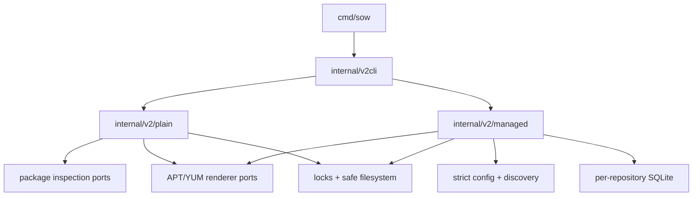

# Architecture Spine — SOW V2 P0-P1

> **Superseded for forward design.** AD-13 remains the historical `v0.2.0` C2 rule. The next architecture preserves its stable ID but replaces the rule with root-Pool parent-relative RPM hrefs; see [`../../next/architecture/ARCHITECTURE-SPINE.md`](../../next/architecture/ARCHITECTURE-SPINE.md). This file must only be used to explain v0.2 implementation/evidence.

## Design Paradigm

Pure-local transactional repository engine. Plain and Managed are isolated applications over shared, stateless package-inspection, metadata-rendering, lock, and safe-filesystem ports.

## Invariants & Rules

### AD-1 — Normative source order [ADOPTED]

- **Binds:** all P0/P1 behavior
- **Prevents:** implementation or tests silently overriding the current contract
- **Rule:** `api-contract.md` governs observable CLI behavior, `prd.md` governs scope and acceptance, and `addendum.md` may only constrain implementation.

### AD-2 — Plain and Managed isolation [ADOPTED]

- **Binds:** P0, P1
- **Prevents:** Workspace/SQLite semantics leaking into `create`, or Plain directories becoming Managed repositories
- **Rule:** Plain imports no Workspace/config/SQLite package; Managed never discovers or mutates a Plain directory implicitly.

### AD-3 — Fixed ownership [ADOPTED]

- **Binds:** Workspace, Repository, Dist, Architecture View
- **Prevents:** two units choosing incompatible owners or paths
- **Rule:** Workspace owns `sow.yml` and `.sow`; each fixed `<workspace>/<repo>` owns `pool/` and `dists/`; each Repository owns one SQLite and private state; Architecture View is projection, not membership.

### AD-4 — Root-bound paths [ADOPTED]

- **Binds:** all filesystem mutation
- **Prevents:** traversal or symlink escape
- **Rule:** derive every owned path from a resolved Workspace/Plain root plus validated fixed relative components, reject symlinks, and re-prove containment before recursive deletion.

### AD-5 — Lock semantics [ADOPTED]

- **Binds:** all write commands
- **Prevents:** incompatible wait behavior and lock ordering
- **Rule:** use POSIX `flock`; timeout zero waits forever, no-wait attempts once, and multi-scope acquisition is Workspace before Repository.

### AD-6 — Journal ownership [ADOPTED]

- **Binds:** P0/P1 recovery
- **Prevents:** SQLite WAL being mistaken for a cross-file transaction
- **Rule:** Plain uses a durable file journal, Workspace lifecycle uses `.sow/workspace-ops`, and Dist lifecycle uses the selected Repository SQLite Operation Journal; `init` creates a Repository shell through the Workspace journal, then initializes each declared Dist through that Repository journal.

### AD-7 — SQLite migration [ADOPTED]

- **Binds:** P1 state
- **Prevents:** incompatible schemas or unsafe downgrade
- **Rule:** one SQLite per Repository, forward-only checksum migrations, consistent `user_version`, WAL plus FULL synchronous, exact DDL bytes fixed by `schema_v1.sql`, and hard failure on unknown newer schema.

### AD-8 — Parser and renderer ports [ADOPTED]

- **Binds:** package facts and metadata
- **Prevents:** V1 Git/CAS/layout assumptions becoming V2 dependencies
- **Rule:** reuse only narrow RPM/DEB facts, native version comparison, metadata encoding/signing, and validation; view location is an explicit caller-owned safe policy.

### AD-9 — Pointer-last commits [ADOPTED]

- **Binds:** P0 metadata and P1 empty Dist
- **Prevents:** clients observing dangling metadata
- **Rule:** stage on the same filesystem, validate and fsync, install immutable metadata, then replace every protocol entry while all old packages still exist; destructive Plain cleanup renames packages only after all RPM/DEB entries switch, and `repo_complete` is its final completion pointer.

### AD-10 — Closed CLI and errors [ADOPTED]

- **Binds:** public API
- **Prevents:** V1/P2/P3 surface leakage or ambiguous automation
- **Rule:** register only `create`, `init`, `config check/show`, `repo ls/new/show/rm`, `dist ls/new/show/rm`, `help`, and `version`; emit `sow.cli/v1` JSON envelopes and map failures only to contract exit codes 0-6.

### AD-11 — Canonical architecture [ADOPTED]

- **Binds:** config and Dist views
- **Prevents:** four aliases becoming four CPU families or input silently expanding config
- **Rule:** canonical families are `x86_64` and `aarch64`; RPM/DEB aliases map at the protocol edge; `noarch/all` projects neutrally; unknown families fail before mutation.

### AD-12 — Init is incremental [ADOPTED]

- **Binds:** `sow init`
- **Prevents:** reruns resetting valid repositories, databases, generations, or views
- **Rule:** create defaults only when config is absent; with valid existing config, initialize only missing Repository/Dist/view objects and treat every valid existing object as read-only evidence.

### AD-13 — Shared Pool safe-href projection [ADOPTED]

- **Binds:** Managed YUM view path and renderer API
- **Prevents:** freezing a layout that DNF or reposync cannot consume
- **Rule:** the direct `../../../pool/...` location candidate is REJECTED because DNF 4.14 reposync rejects its escaped local target. Adopt the proven C2 redesign: root Pool owns canonical regular files; each architecture view owns same-filesystem regular hardlinks at view-local `pool/...`; metadata href is safe `pool/...`; Dist removal unlinks aliases only. Native + noarch makecache/query/download/install/reposync and a non-hardlink-preserving copied tree passed. Hardlink failure is fatal, never a silent copy fallback; state stores logical family, not a configurable physical path.

### AD-14 — P2/P3 absence [ADOPTED]

- **Binds:** current binary and config
- **Prevents:** placeholders being mistaken for delivered capability
- **Rule:** P2/P3 may have internal data seams only; no command, flag, remote concept, fake implementation, or completion claim is active.

### AD-15 — Operational envelope [ADOPTED]

- **Binds:** all implementation and build units
- **Prevents:** CGO, external repository tools, unsupported filesystems, or platform-specific behavior entering silently
- **Rule:** the deliverable is one pure-Go binary buildable with `CGO_ENABLED=0` for darwin/linux × amd64/arm64; only GPG may be an external runtime, and writes require local POSIX single-writer flock/fsync/atomic-rename semantics rather than NFS or multi-writer operation.

### AD-16 — State-aware config validation [ADOPTED]

- **Binds:** `config check` and every P1 write preflight
- **Prevents:** config removing an architecture still present in Dist, Membership, or Built state
- **Rule:** validation is read-only but must compare normalized config with every initialized Repository SQLite and valid protocol view; referenced-family removal returns 6 and contradictory/damaged evidence returns 5.

## Consistency Conventions

| Concern | Convention |
| --- | --- |
| Names and paths | Lowercase validated entity names; `/` in persisted relative paths |
| Stable bytes | Sort by logical identity/basename; fixed timestamps and deterministic compression |
| Mutation | lock → recover → journal planned → stage/validate/fsync → apply → pointer last → done |
| Errors | typed class at domain boundary; CLI alone maps to 0/1/2/4/5/6 |
| Secrets | references/fingerprints only outside resolver memory |

## Stack

| Name | Version |
| --- | --- |
| Go | 1.26.5 |
| modernc.org/sqlite | 1.53.0 |
| gopkg.in/yaml.v3 | 3.0.1 |
| pault.ag/go/debian | 0.21.0 |
| patched cavaliergopher/rpm | 1.3.0 |

## Structural Seed

## Capability → Architecture Map

| Capability / Area | Lives in | Governed by |
| --- | --- | --- |
| P0 Plain Create | `internal/v2/plain`, `internal/v2cli` | AD-2, AD-5, AD-6, AD-8, AD-9 |
| P1 config/discovery | `internal/v2/config` | AD-1, AD-3, AD-4, AD-11, AD-12 |
| P1 repo/dist lifecycle | `internal/v2/managed`, `internal/v2/state` | AD-3, AD-5, AD-6, AD-7, AD-9 |
| Public API | `internal/v2cli` | AD-10, AD-14 |
| Client compatibility | `test/poc`, `test/compat` | AD-9, AD-11, AD-13 |

## Deferred

- Non-empty Managed membership mutation, policy reconciliation, package signing, and add/rm are P2.
- Query/status/build/check/generation/changes/log are P3.
- Remote upload/sync/publish, Route, modulemd, manifest, rejected, GC, services, and multi-writer operation are outside the V2 P0/P1 architecture.
