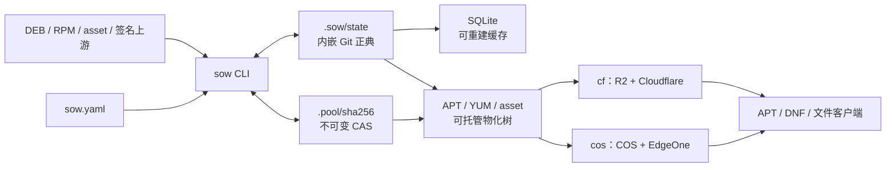

# SOW 当前实现：功能与能力全景

> **历史 V1 产品文档。** 本文描述基础 commit `50f183cc8125d09199dcdf38eec4fd86eeb338bf` 上的 Git/CAS/远端发布架构，不是当前 `cmd/sow` 的 SOW V2 产品契约，也不能用来判断 V2 命令、配置、签名依赖或验收状态。v0.2 行为以 [`architecture.md`](architecture.md) 和 P1–P3 historical SPEC 为准；下一版 Repository/publish 设计以 [`../next/`](../next/) 为准。本文的 workspace-global CAS、snapshot copy、route 与 hardlink 物化只能作为 brownfield 资产和历史设计参考。

> 文档类型：产品能力说明与使用导览
>
> 核对日期：2026-07-31
>
> 适用版本：当前开发版 `sow 0.1.0-dev`
>
> 目标读者：Pigsty 仓库维护者、镜像站运营者、发布工程师，以及评估 SOW 的开发者

SOW 是一个用 Go 编写的软件制品仓库管理 CLI。它把 APT、YUM 和普通文件仓库统一成一个“制品仓库的 Git”：

- Git 保存仓库正典状态、通道、快照、发布记录和 provenance；
- SHA-256 CAS 保存不可变制品；
- hardlink 物化出可由 Nginx 直接托管的仓库树；
- Cloudflare/R2 与腾讯云 COS/EdgeOne 作为两个可独立推进的发布目标；
- `publish` 把差异上传、索引翻转、最小 purge、发布后验证和远端 checkpoint 收进同一事务。

当前准确口径是：**本地 MVP 和产品主体已经可以运行，但完整终局尚未验收，不能称为 production-ready**。FR-01–FR-42 中，23 项已验证，16 项已实现但仍待真实外部环境验收，3 项仍在实现或生产迁移闭环中。最新状态以[历史需求可追踪矩阵](../../docs/requirements-traceability.md)为准。

### 状态和证据说明

| 表述 | 含义 |
|---|---|
| 已验证 | 能力已进入真实 CLI，并有当前要求对应的文件系统、协议、真客户端或性能证据 |
| 已实现，待外部验收 | 产品路径完整，但真实供应商、生产树或运营数据尚未实跑 |
| 实现中 | 已有实现，但仍存在明确的兼容、迁移或外部闭环缺口 |

证据必须分层理解：本地文件系统测试不等于协议证据，MinIO 不等于 R2/COS，真 apt/dnf 容器不等于穿 Cloudflare/EdgeOne，真实非生产 R2 数据面也不等于完整双云或生产运营验收。

## 1. SOW 能解决什么问题

SOW 主要解决传统仓库脚本体系中的四类问题：

1. **状态失联**：索引、包体、本地目录和远端对象之间缺少统一真相源。
2. **流程遗忘**：上传、翻转、purge、验证由人工分步执行，容易漏掉关键步骤。
3. **通道管理困难**：beta、latest、stable、历史快照经常靠复制目录和手写目标维护。
4. **商业内容隔离风险**：公开索引可能误引用 gated 包，或 token 进入缓存键造成碎片和泄漏风险。

SOW 对应提供：

- Git 正典与可重建缓存；
- 可恢复、可重放的本地和远端事务；
- 视图与快照代数；
- public/gated 机密性闭包；
- 增量发布和显式全量审计；
- 可执行的存量迁移与回滚门禁。

## 2. 核心模型

可以用下面的对应关系理解 SOW：

| Git 概念 | SOW 中的对应物 |
|---|---|
| 对象数据库 | `.pool/sha256` 中的不可变 CAS 制品 |
| commit | manifest、配置身份、provenance 和生命周期状态的正典快照 |
| branch | `beta`、`latest`、`stable` 通道视图 |
| tag | `<suite>-YYYYMMDD` 不可变快照 |
| working tree | APT/YUM/asset 可直接托管的物化树 |
| remote-tracking ref | `refs/sow/remotes/<target>/...` |
| remote checkpoint / generation fence | 远端 `.sow/manifest.json` 检查点与代际围栏 |

SQLite 不是真相源。`.sow/cache/state.db` 只是从 Git 正典生成的查询投影，丢失或损坏时可以通过显式恢复重建。



本地只有一个写者；只读校验可以并发。两个云目标分别维护自己的远端状态，一个目标失败不会回滚另一个已经完成的目标。

### 常用术语

| 术语 | 本文含义 |
|---|---|
| 正典 | 唯一权威状态；在 SOW 中是内嵌 Git 的 commit、manifest 和 ref |
| CAS | 按 SHA-256 寻址的不可变内容池 |
| view / 视图 | beta、latest、stable 等通道清单 |
| generation / 代 | 一次目标发布生成的不可变完整对象集合 |
| checkpoint / 检查点 | 远端当前代及其父代、计划、状态的 CAS 控制对象 |
| journal / 事务日志 | 中断后用于检测、验证和重放的持久化意图 |
| purge | 精确失效 CDN 中的可变入口缓存 |
| provenance / 来源收据 | 上游声明、下载位置、签名根与制品字节之间的证据链 |
| fail-closed / 失败关闭 | 证据不完整时拒绝变更或服务，而不是猜测或放宽 |
| origin / 源站 | CDN 或边缘函数读取仓库对象的后端 |

## 3. 产品能力总览

| 能力域 | SOW 可以完成的任务 | 当前成熟度 |
|---|---|---|
| 存量纳管 | 零字节扫描既有服务树；校验并导入现有 APT/YUM/asset 内容 | 本地已验证 |
| APT 仓库 | 生成 Packages、Release、Release.gpg、InRelease、by-hash 和标准快照 suite | 已验证 |
| YUM 仓库 | 生成 primary/filelists/other、repomd 与签名，支持 generation mirrorlist | 强路径已验证；生产 raw alias 迁移仍在闭环 |
| asset 仓库 | 管理 bin/src/pkg/etc/img 等无索引文件和受控可变别名 | 已验证 |
| 包生命周期 | 接纳、移除、去重、hardlink 物化、引用审计和确认式 GC | 已验证 |
| 上游同步 | 签名上游只加不删同步、过滤、重试、断点恢复和 provenance | 已验证 |
| 通道与快照 | beta/latest/stable、历史钉版、不可变快照、EOL 冻结归档 | 本地核心已验证；部分远端策略待验收 |
| 本地服务 | 生成可直接托管的树、default-deny Nginx include、离线 tgz | 已验证 |
| 双云发布 | R2/Cloudflare 与 COS/EdgeOne 独立 generation、checkpoint、purge、恢复 | 已实现；完整真实双云验收未完成 |
| 校验与审计 | L1–L4、远端 inventory、漂移报告、事务恢复、残留审计 | L1 与本地真实客户端/协议 L4 已验证；真实双云 L2/L3/L4 待验收 |
| Pro 访问控制 | public/gated 分池、token-in-path、动态 mirrorlist、Basic 回退 | token-in-path 与本地协议已验证；其余待真实边缘验收，同构边缘仍在闭环 |
| 存量迁移 | Makefile 能力映射、YUM 兼容状态机、分阶段切换和回滚 | 本地工具已具备；生产切换未完成 |

这里的“已实现”表示真实产品路径存在，并不等于已经在供应商或生产环境中通过验收。

## 4. 命令面

当前源码提供以下命令：

| 命令 | 作用 |
|---|---|
| `sow init` | 扫描配置拥有的仓库树，建立零字节基线；可进一步纳管现有内容 |
| `sow add` | 接纳 DEB、RPM 或 asset，导入 CAS，更新视图、索引和服务树 |
| `sow rm` | 从可变视图移除包或 asset，并重建自洽索引 |
| `sow sync` | 从签名上游累积同步，只加不删，并保存 provenance |
| `sow promote` | 在视图间执行清单并集；只允许从 stable 创建当日 UTC 不可变快照 |
| `sow materialize` | 将视图或快照精确物化为 hardlink 树、Nginx include 或离线 tgz |
| `sow publish` | 发布视图/快照，或把历史远端 generation 前向恢复为新一代 |
| `sow verify` | 执行 L1–L4 分层校验并输出文本或 JSON 报告 |
| `sow fsck` | 执行昂贵的本地/远端全量审计、inventory 纳管和显式恢复 |
| `sow gc` | 计算不可达对象集合；只有再次确认精确摘要才删除 |
| `sow compatibility` | 管理冻结的 mixed-EL YUM 树：纳管、候选、冻结、切换、回滚 |
| `sow version` | 输出版本、平台和 Go 版本 |
| `sow help` | 显示主命令帮助 |

每个命令都可以用 `sow <command> --help` 查看当前源码真实注册的参数。帮助输出不会回显调用者传入的 secret 文件路径或秘密正文。

### 4.1 作用域选择器与命令专属参数

多数仓库命令共享三个严格作用域选择器：

- `--repo`：仓库 ID 或仓库组；
- `--os`：操作系统或 suite/major 维度；
- `--arch`：架构。

这三个选择器在支持它们的命令中可重复或用逗号分隔。逻辑操作保持严格作用域；如果局部选择会破坏共享物理仓库闭包，SOW 会补齐同一物理 owner 的本地验证，或直接失败，而不会产出半个可服务仓库。

其余参数属于特定命令，不能混为通用选择器：

- `rm --view` 只接受单个 `beta|latest`；publish/verify 等命令的 view 参数各有自己的重复和默认规则；
- `--snapshot` 只出现在 publish/verify 等快照入口，且各命令的基数不同；快照创建使用 `promote stable <suite>-YYYYMMDD`；
- publish/verify/fsck 的 `--target` 选择可重复的 `cf|cos`，materialize 的 `--target` 是单个本地导出目录；
- `--upstream` 只属于 sync，可重复或逗号分隔；
- `--workers` 是 1–64 的并发预算，不是业务选择器。

参数组合、默认值和互斥关系以 `sow <command> --help` 为准。

### 4.2 退出码

| 退出码 | 含义 |
|---:|---|
| 0 | 成功 |
| 1 | 内部错误 |
| 2 | 命令用法错误 |
| 3 | 配置错误 |
| 4 | 校验失败或字节漂移 |
| 5 | 网络或鉴权失败 |
| 6 | 状态冲突、锁冲突或远端漂移 |
| 7 | 多目标发布部分成功 |

## 5. 三类仓库引擎

### 5.1 APT

APT 引擎可以：

- 解析并接纳已有 `.deb`；
- 生成 Packages 索引及其压缩变体；
- 生成 Release、Release.gpg 和 InRelease；
- 内建 SHA-256 by-hash，并维护有界代际；
- 生成标准 suite 快照；
- 使用单一 repository signing identity 签名元数据；
- 让真实 apt 客户端按原生版本号安装历史版本。

最低支持版本是 **apt 1.2**。更老的 apt 明确不受支持，因为它不能依靠 by-hash 在可变通道中闭合跨对象翻转。

### 5.2 YUM / DNF

YUM 引擎可以：

- 解析 RPM 的 NEVRA、依赖、文件列表和嵌入签名；
- 生成 primary、filelists、other 三类 metadata；
- 生成并签名 repomd.xml；
- 为 EL9/EL10 使用 zstd；
- EL8 自 Pigsty v5.0.0 起只支持 frozen/gzip；
- EL7 只通过 legacy frozen/gzip 兼容路径保留，active EL7 不受支持；
- 把完整 metadata 与包体放入不可变 generation；
- 通过单个 generation-pinned mirrorlist 完成强一致通道翻转；
- 保留有限个旧 generation 的 payload，使持有旧 metadata 的客户端完成下载。

repository metadata 签名和 RPM 包签名是两条不同信任链：Managed SOW 用唯一 repository key 签 repomd；RPM 本体由 repo 配置中的 public-only `yum.package_keyring` 验证。Managed Day 1 保留上游 RPM 原字节和嵌入签名；独立的 Plain `sow create --sign-with` 可显式补签，只有再加 `--overwrite` 才全量重签。

必须注意：对象存储无法把 raw `repomd.xml` 与 `repomd.xml.asc` 两个 key 真正原子替换。SOW 的强保证来自 generation-pinned mirrorlist。长期停留在 raw baseurl 的客户端属于迁移兼容路径，不能宣称具备相同原子性。

### 5.3 Asset

Asset 是无索引仓库，可管理：

- 安装脚本和引导程序；
- 源码归档；
- 工具二进制；
- 离线包；
- 配置、图片和其他普通文件。

Asset 仍然参与 manifest、CAS、视图、发布、审计和恢复。路径默认不可变；只有配置在 `asset.mutable_paths` 中的兼容别名才允许显式替换。

## 6. 存量纳管

### 6.1 零字节基线

```bash
sow init --config sow.yaml
sow fsck --config sow.yaml
```

默认 `init` 只扫描配置拥有的服务树，建立排序 manifest 和 Git 基线：

- 不导入包体到 CAS；
- 不改写现有 APT/YUM/asset 字节；
- 不触发结构迁移；
- 支持按 repo/OS/arch 先做局部基线，再扩展为全量基线。

这适合先把存量仓库纳入审计，而不改变当前服务。

### 6.2 内容纳管

```bash
sow init --adopt-content --view latest --config sow.yaml
```

`--adopt-content` 会：

- 从真实 APT/YUM 索引或 asset baseline 反向证明现有内容；
- 验证 APT/YUM metadata 签名及索引声明的 size/SHA-256；
- 对 RPM 另外使用 public-only package keyring 验证嵌入签名；DEB 本体没有对应的 RPM 式嵌入签名身份；
- 导入 CAS；
- 建立 legacy receipt；
- 创建 latest，可选 stable 视图；
- 仍不改写当前服务树，直到后续显式 materialize。

旧 YUM metadata 的信任不会从新 repository key 自动推导。需要声明历史签名时，必须提供 public-only `--legacy-metadata-keyring`。索引引用但本地缺失的 RPM 默认阻断；只有在人工确认精确 blocker-set 后，才能使用内容绑定的 prune confirm，并把负向事实写入 provenance。

## 7. 包和文件生命周期

### 7.1 接纳

```bash
sow add package.rpm --repo pgsql-el9-x86-64 --config sow.yaml
sow add package.deb --repo pgsql-trixie-amd64 --config sow.yaml
sow add tool.tar.gz --repo assets-bin --dest pkg/tool.tar.gz --config sow.yaml
```

`add` 会自动或显式识别 `asset|rpm|deb`，校验输入，导入 CAS，更新正典视图，重建索引并刷新服务树。DEB/RPM 输入先进入私有快照，再以相同 size/SHA-256 导入，避免调用者在检查与安装之间替换文件；RPM 还必须保持已经验证的嵌入签名身份。

外部 builder 可以逐输入绑定交付物：

```bash
sow add package.rpm \
  --repo pgsql-el9-x86-64 \
  --expected-object sha256:<digest>:<size> \
  --config sow.yaml
```

SOW 不构建包；它只接纳 builder 已经产出的字节。摘要或长度不匹配会在新 CAS 对象和视图变更前失败。

### 7.2 移除

```bash
sow rm package-name --view beta --repo pgsql-el9-x86-64 --config sow.yaml
sow rm path/to/asset --view latest --repo assets-bin --config sow.yaml
```

`rm` 只作用于可变视图。stable 与快照是保留根，不能通过普通减包破坏历史。末包移除后，APT/YUM 仍生成合法、已签名的空索引；显式 materialize 会精确清除当前服务树中的旧入口。

### 7.3 CAS 和 GC

同一 SHA-256 内容在本地 CAS 中只保存一次，多个视图和物化树通过 hardlink 复用。GC 分两步：

```bash
sow gc --config sow.yaml
sow gc --config sow.yaml --apply --confirm <gc_set_sha256>
```

第一步只报告当前不可达集合及其摘要；第二步只接受同一当前状态重新算出的精确摘要。仓库状态变化、旧摘要重放或保留根缺失都会失败，不会删除新对象。

## 8. 上游同步与 provenance

```bash
sow sync --upstream pgdg-apt,pgdg-yum --config /secure/sow-pgdg.yaml
```

同步器具有以下语义：

- **只加不删**：上游删除旧版本不会让本地历史消失；
- 支持 package name + arch 的 allow/deny 过滤；
- debuginfo 独立控制；
- 下载有界并发、校验、重试和断点恢复；
- 上游凭据只从 `env://` 引用读取；
- HTTP 重定向到不同 host 时自动剥离 Bearer；
- 重放相同上游状态不会重复下载和推进正典。

RPM 与 DEB 的 provenance 不对称：

- RPM 保存上游 URL、索引摘要、原始 RPM 字节和嵌入签名证明；
- DEB 保存上游 URL、Packages 条目摘要，以及真正被签名的 InRelease/Release 上游证据。

因此 SOW 能证明“从哪里来、上游声明了什么、实际保存了哪些字节”，而不是只记录一个下载 URL。

## 9. 通道、历史和快照

| 视图 | 访问 | 可变性 | 典型用途 |
|---|---|---|---|
| `beta` | public | 可变 | 新包、测试包和预发布内容 |
| `latest` | public | 可变 | OSS 精选稳定内容，保持现有 URL 契约 |
| `stable` | Pro | append-only | 完整历史、原生钉版、企业交付 |
| `<suite>-YYYYMMDD` | Pro / stable 派生 | 不可变 | 时间点快照、EOL 归档、回滚与离线交付 |

`promote` 是清单运算，不复制包体。进入 latest 的转正内容会按既定视图代数保留在 append-only stable 历史中：

```bash
sow promote beta latest --repo pgsql-el9-x86-64 --config sow.yaml
SNAPSHOT="trixie-$(date -u +%Y%m%d)"
sow promote stable "$SNAPSHOT" --config sow.yaml
```

stable 的核心语义是“包不消失”。客户可以继续使用 apt/dnf 原生版本选择安装旧版。快照由 UTC 日期命名；同一 suite 在同一 UTC 日期只能对应一个内容身份，同内容重放幂等，不同内容拒绝，防止回填或改写历史。

## 10. 物化、Nginx 和离线交付

### 10.1 可托管树

```bash
sow materialize latest --config sow.yaml
sow materialize stable --config sow.yaml
sow materialize trixie-20260731 --target export/trixie-20260731 --config sow.yaml
```

物化输出包含完整包体、索引、签名、by-hash、repodata、mirrorlist 和 asset。默认树和显式导出都是正典 ref 的派生结果；显式导出不会移动基线服务树。

### 10.2 Nginx include

```bash
sow materialize latest --config /etc/sow/sow.yaml \
  --nginx-include /etc/nginx/sow-latest.locations.conf
```

生成器只输出配置与正典状态拥有的精确路由：

- 只允许 GET/HEAD；
- 禁止 symlink 穿透；
- 暴露必要的仓库、generation、mirrorlist 和公开 key；
- 固定以 `location / { return 404; }` 关闭未知路径；
- 不暴露 `.sow`、`.pool`、`.git`、`sow.yaml` 或 secret canary。

该模式只生成 include。SOW 不管理 TLS 证书、Nginx 进程或 reload；操作者仍需运行 `nginx -t` 并使用现有原子 reload 流程。

### 10.3 离线 tgz

```bash
sow materialize trixie-20260731 \
  --gpg-private-key-file /secure/repository-private.asc \
  --tgz offline/pigsty-pkg-trixie-20260731.tgz \
  --config sow.yaml
```

归档从完成物化后的精确 manifest 生成，包含可直接消费的完整仓库，而不只是包体。文件顺序、时间戳、压缩和签名输入均绑定正典状态，可复现重建。还可以用 `--asset-repo` 把生成的 tgz 重新纳入 asset 仓库，形成离线制品闭环。

## 11. 发布事务

`publish` 面向配置中的 `cf` 和 `cos` 目标：

```bash
sow publish --view latest --target cf,cos --config sow.yaml
```

一次发布按以下顺序执行：

1. 校验配置、签名信任、选择器和 public/gated 闭包；
2. 冻结精确 ref vector、目标身份和发布计划；
3. 从本地 remote refs 计算 O(变更集) 差异；
4. 上传包体、CAS 对象和不可变 metadata generation；
5. 翻转 APT/YUM/asset 的最小可变入口；
6. purge 精确的指针、索引入口和被删除 asset URL；
7. 执行发布后验证；
8. CAS 提交远端 checkpoint，再推进本地 remote refs。

普通增量发布不会通过 ListObjects 猜测桶状态。只有显式远端 `fsck` 才做全量 List。

### 11.1 两目标独立推进

Cloudflare/R2 和 COS/EdgeOne 分别维护 journal、generation、checkpoint、purge 证据和 remote refs。一个目标失败时：

- 已成功目标保留成功状态；
- 失败目标保留可恢复事务；
- 命令返回 7；
- 重跑复用原 generation 和 journal，不重做已闭合工作。

### 11.2 历史代恢复

```bash
sow publish --restore-generation 42 --target cf --config sow.yaml
```

恢复不是倒退 checkpoint。SOW 从本地记录的历史 ref/CAS 重建目标内容，以当前 generation 为 parent 发布一个新的前向代。一次只能恢复一个目标；不会移动本地 beta/latest/stable，也不会改写不可变历史。

stable 恢复还必须与当前 stable ref vector 完全一致，不能借 restore 删除后来版本或让 stable 倒退。需要对外提供历史钉版时，应发布对应 snapshot。

### 11.3 删除语义

默认远端删除要求供应商真正支持条件 DeleteObject。若供应商忽略 `If-Match`，SOW 会在触碰 live key 前失败。R2 的受限 `checkpoint-fenced` 模式只适用于旧发布者和写凭据已经撤销、确认单操作者的目标；它不是通用多写者协议。

## 12. 校验、审计和恢复

### 12.1 L1–L4

| 层级 | 校验范围 |
|---|---|
| L1 | 本地索引↔包体双向闭包、签名、CAS、视图、服务树和机密性闭包 |
| L2 | 本地 ref vector、checkpoint、generation 与远端对象对账 |
| L3 | 穿 CDN 流式验证实际响应的 size、SHA-256、路由和缓存前门 |
| L4 | 按 apt/dnf 协议链读取 metadata、by-hash/mirrorlist、包体和签名 |

```bash
sow verify --layer L1 --view latest --config sow.yaml
sow verify --layer L2,L3,L4 --view stable --target cf \
  --pro-token-file /secure/pro-token --config sow.yaml
```

`--json` 可以输出确定性结构化报告。稳定/Pro 的运行时 token 只用于内存中的请求路径投影，不进入 Git、plan、journal 或报告。

### 12.2 fsck

本地 `fsck` 会重新扫描配置拥有的树，报告 manifest、CAS、服务树、缓存、journal 和 derived-state 漂移。远端模式会执行分页 ListObjectsV2、HEAD 和必要的流式 GET，报告：

- missing；
- changed；
- orphan；
- unknown；
- 0-byte checksum；
- checkpoint、generation 和 purge 历史不闭合。

```bash
sow fsck --config sow.yaml
sow fsck --target cf --adopt-remote-inventory --config sow.yaml
```

远端 inventory adoption 要求两次稳定 List、逐对象验证和本地服务树子集证明；额外远端对象只会保留并报告，不会被普通 publish 擅自删除。

### 12.3 显式恢复

```bash
sow fsck --recover --config sow.yaml
sow sync --upstream pgdg-apt --recover --config sow.yaml
sow materialize latest --recover --config sow.yaml
sow publish --view latest --target cf --recover --config sow.yaml
```

`fsck --recover` 主要负责从 Git 正典重建 SQLite，并收敛通用 derived-state 残留。具体业务事务必须使用**原动词、原 config、原 selector、原信任材料和原事务身份**加 `--recover` 重放；fsck 不会替 add、sync、materialize 或 publish 接管业务语义。

业务恢复可以：

- 完成已提交但未物化的事务；
- 收敛受支持的 derived-state 临时态；
- 安全重放被中断的 add、sync、materialize 和 publish；
- 拒绝与原 config、selector、HEAD、信任身份或输入向量不一致的接管。

无输入的 `sow add --recover` 只对已经持久化完整输入身份的中断 asset add 成立。RPM/DEB 如果 CAS 字节缺失，仍需提供 frozen ref 精确记录的原包条目，不能用新输入或跨格式条目替代。

普通命令不会静默掩盖无标记的缓存或文件漂移。两个窄作用域修复入口是：

```bash
# 只从 immutable Git anchor 恢复历史 purge receipt；不联网、不访问供应商。
sow fsck --target cf --repair-purge-ledger --config sow.yaml

# 审阅 fsck 报告后，一次只退休一个当前 inode/bytes 绑定的审计副本。
sow fsck --retire-preserved-projection <exact-name> \
  --confirm <retire-token> --config sow.yaml
```

preserved projection 不会被普通 `--recover` 或 GC 自动删除。对象被替换、加硬链接或修改元数据后，旧 token 会失效。

## 13. Pro / OSS 合一仓库

SOW 每个云只使用一个物理仓库，OSS 与 Pro 由 metadata 视图区分，而不是复制成两个桶：

- public 池保存公开字节；
- gated 池保存必须鉴权的字节；
- beta/latest 的引用闭包必须完全落在 public；
- stable 可以引用 public + gated；
- 同一公开包体在 OSS/Pro 视图间不重复保存。

公开闭包门禁作用于 add、adopt、promote、publish 和 L1，没有 `--force` 或 `--skip` 绕过面。

### 13.1 token-in-path

Pro URL 固定为：

```text
/pro/v1/{token}/...
```

APT/YUM metadata 使用相对链接，使 token 前缀自然贯穿请求。边缘组件完成：

1. 校验 token；
2. 检查 audience、路径和过期时间；
3. 剥离客户 token；
4. 以不含 token 的干净 URL 请求 origin；
5. 动态填充 Pro YUM mirrorlist；
6. 返回版本化边缘合同标记。

Cloudflare Worker 与 EdgeOne 函数共享同一可观察合同和测试向量。直接 R2 binding 与 COS SigV4 模式可以提供私有读取，但缓存状态是 BYPASS；只有另行配置并真实验收的 clean same-host fetch 才能证明多客户共享缓存。

### 13.2 边缘部署合同

```bash
sow materialize latest --edge-contract cf --config sow.yaml
```

该命令输出从当前配置与正典状态生成的无 secret、版本化部署合同，包含 public 前缀、公开 key、ordinary/compatibility YUM 路由和 token verifier 引用。Cloudflare/EdgeOne 的部署变量必须来自这份文档，不能手写、合并或放宽。它只渲染部署制品，不调用云 API。

### 13.3 Basic Auth 回退

边缘函数不可用或缓存 PoC 不通过时，stable 可由独立 Nginx Basic Auth 服务：

```bash
sow materialize stable --config sow.yaml \
  --nginx-include /etc/nginx/sow-stable.locations.conf \
  --nginx-auth-user-file /etc/nginx/sow.htpasswd
```

该路径固定为 `/pro/v1/basic/`，所有响应必须 `private, no-store`，不能接入忽略 Authorization 的共享缓存。客户端凭据放在 apt `auth.conf` 或 DNF 的独立 username/password 字段，不写入仓库 URL、mirrorlist、镜像或日志。

## 14. 配置模型

SOW 使用严格的 `schema: sow/v1`。主要区块包括：

| 区块 | 作用 |
|---|---|
| `state` | 快照物化月数、APT by-hash/YUM generation 保留、CAS 历史窗口 |
| `gpg` | repository public key、private key 和 passphrase 的安全引用 |
| `pools` | public、gated 等机密性池 |
| `repos` | APT/YUM/asset 仓库、路径、OS、arch、生命周期和信任 |
| `repo_groups` | 可被 `--repo` 选择的仓库组 |
| `compatibility_projections` | 冻结 mixed-EL YUM 兼容树 |
| `upstreams` | 上游 URL、目标仓库、过滤器、keyring 和凭据引用 |
| `views` | beta/latest/stable 的访问、池、debuginfo 和 append-only 策略 |
| `serving` | 各视图的干净 base URL |
| `targets` | R2/COS 存储与 Cloudflare/EdgeOne CDN 配置 |
| `edge` | Pro URL 前缀和 token verifier 引用 |

配置具有以下 fail-closed 行为：

- 未知字段拒绝；
- 云和 upstream credential 在 YAML 中只接受 `env://`；GPG key/passphrase、Pro token 等只有明确提供文件参数的 CLI 入口才能读取受保护文件；
- 路径逃逸、symlink keyring、private key 误作 trust bundle 拒绝；
- provider union、base URL、beta/latest host、EL 生命周期不一致拒绝；
- 配置输入和展开后的 canonical YAML 均有 8 MiB 上限；
- repo/upstream 拓扑有独立的工作量和派生字符串预算；
- 发布身份绑定 canonical 配置及当前 ref vector 真正可达的 package keyring 字节。

最小样例见 [`sow.example.yaml`](../../sow.example.yaml)，PGDG 上游样例见 [`docs/examples/sow-pgdg.yaml`](../../docs/examples/sow-pgdg.yaml)。

## 15. 安全与可靠性设计

### 15.1 签名和信任

- repository metadata 只有一个在线 signing identity；
- APT 同时生成 clearsigned InRelease 和 detached Release.gpg；
- YUM 生成 repomd.xml.asc；
- RPM package signer 由独立 public-only keyring 验证；
- 私钥和 passphrase 仅经 env 或受保护文件注入；
- Managed metadata 签名和验证均在 Go 进程内完成；Plain `create --sign-with` 例外调用环境中的 `rpm`/GPG 工具链；
- 在线更换 repository signing identity 被禁止，换钥是单独的离线迁移。

### 15.2 文件系统

- 控制目录和文件使用 owner、mode、inode、link count 和 no-follow 检查；
- symlink、special file、目录替换和 root 交换失败关闭；
- journal 在 mutation 前持久化；
- commit 后恢复只允许完成，不允许静默回滚正典；
- CAS 对象不可变，物化时重新校验并使用 hardlink；
- Nginx 输出只开放正典拥有的精确路由。

SOW 的威胁模型是单操作者、单写者。另一个具有同 UID、已持有可写 descriptor 的恶意进程，root 权限、扩展 ACL 绕过或语义不可靠的网络文件系统，不在其文件系统事务保证内。

### 15.3 Secret 和日志

以下内容不会写入 Git、manifest、journal、plan 或日志：

- repository private key；
- passphrase；
- R2/COS access secret；
- Cloudflare/腾讯云控制面 secret；
- Pro token；
- Basic Auth password。

配置快照只保存非 secret 身份和 `env://` 引用。token 在边缘鉴权后从 origin URL、请求头和共享缓存键中剥离。

## 16. 性能、兼容和交付形态

当前已经建立的本地/协议证据包括：

- 50k 条目级 manifest、APT/YUM 索引、hardlink 物化和发布计划；
- 50,000 个不同 asset 的真实 CLI 纳管、CAS、view、provenance 和缓存闭包；
- 50k 仓库只变一个对象时，发布计划仍为 O(变更集)；
- 有界 worker 和流式处理，不把整个仓库载入内存；
- 真实 apt 1.2/2.4、YUM 3.4.3、EL8/9/10 DNF 客户端消费；
- 本地 MinIO S3/SigV4；
- 专用非生产 R2 的 storage、actual-CLI publication-storage 和 storage-only fsck 窄化实证；
- Linux/macOS × amd64/arm64 的 `CGO_ENABLED=0` 构建；
- 可复现 clean-delivery 归档门禁。

真实 R2 子证据不包含真实 Cloudflare Worker、purge、CDN 或 cache-log，也不替代 COS/EdgeOne 和双云验收。这些证据整体证明本地算法、协议、签名和制品形态，不代表真实公网带宽、双云总时延、CDN cache HIT 或生产迁移已经验收。

CLI 是单一 Go 二进制，普通路径不需要 Python、Perl、外部 gpg、createrepo_c 或常驻 SOW 服务；只有显式的 Plain `create --sign-with` 需要环境中的 RPM/GPG 工具链。边缘 Worker/函数是独立部署制品，不属于 CLI 运行时依赖。

## 17. 典型工作流

### 17.1 无云凭据的本地 asset 闭环

```bash
CGO_ENABLED=0 go build -trimpath -o sow ./cmd/sow

cp sow.example.yaml sow.demo.yaml
mkdir -p sow-demo-root/bin \
  sow-demo-root/yum/pgsql/el9.x86_64 \
  sow-demo-root/apt/pgsql/trixie
chmod -R 0755 sow-demo-root
printf 'sow demo\n' > sow-demo.bin

./sow init --config sow.demo.yaml --root sow-demo-root
./sow add sow-demo.bin --repo assets-bin \
  --config sow.demo.yaml --root sow-demo-root
./sow promote beta latest --repo assets-bin \
  --config sow.demo.yaml --root sow-demo-root
./sow materialize latest --repo assets-bin --target export/latest \
  --config sow.demo.yaml --root sow-demo-root
./sow verify --layer L1 --view beta,latest --repo assets-bin \
  --config sow.demo.yaml --root sow-demo-root
./sow fsck --config sow.demo.yaml --root sow-demo-root
test -f sow-demo-root/export/latest/bin/sow-demo.bin
```

SOW 生命周期命令不访问上游或云，也不需要签名私钥。若本地 Go module cache 为空，第一行 `go build` 仍可能按 Go 工具链配置下载源码依赖。仓库根及其真实祖先还必须允许 Nginx worker 穿越，路径不得经过 symlink。

### 17.2 新包发布列车

```bash
sow add package.rpm --repo pgsql-el9-x86-64 --config sow.yaml
sow verify --layer L1 --view beta --repo pgsql-el9-x86-64 --config sow.yaml
sow promote beta latest --repo pgsql-el9-x86-64 --config sow.yaml
sow materialize latest --repo pgsql-el9-x86-64 --config sow.yaml
sow publish --view latest --repo pgsql-el9-x86-64 \
  --target cf,cos --config sow.yaml
```

最后一步会修改配置中的真实云目标，只能在经过授权和预检的非生产或生产发布窗口执行。

### 17.3 历史快照和离线包

```bash
SNAPSHOT="trixie-$(date -u +%Y%m%d)"
sow promote stable "$SNAPSHOT" --config sow.yaml
sow materialize "$SNAPSHOT" \
  --tgz "offline/pigsty-pkg-${SNAPSHOT}.tgz" \
  --config sow.yaml
```

### 17.4 漂移审计和恢复

```bash
sow verify --layer L1 --config sow.yaml
sow fsck --config sow.yaml
sow fsck --recover --config sow.yaml
sow fsck --target cf --config sow.yaml
```

不要手工删除 active journal。恢复必须使用原 config、selector、信任材料和事务身份重放。

### 17.5 冻结 mixed-EL YUM 迁移

```bash
sow compatibility yum-adopt --id infra-legacy-x86-64 --config sow.yaml
sow compatibility yum-candidate --id infra-legacy-x86-64 \
  --output /outside/hosted-root/infra-legacy-x86-64 \
  --gpg-private-key-file /secure/repository-private.asc --config sow.yaml
sow compatibility yum-freeze --id infra-legacy-x86-64 \
  --candidate /outside/hosted-root/infra-legacy-x86-64 \
  --confirm sha256:<freeze-token> --config sow.yaml
sow compatibility yum-cutover --id infra-legacy-x86-64 \
  --confirm sha256:<cutover-token> --config sow.yaml
sow materialize latest --config sow.yaml
sow verify --layer L1 --view latest --config sow.yaml

# 回滚 token 由 cutover 输出；回滚追加审计事件，不删除冻结证据。
sow compatibility yum-rollback --id infra-legacy-x86-64 \
  --confirm sha256:<rollback-token> --config sow.yaml
```

该状态机专门处理旧 `yum/infra/{arch}` mixed-EL 树，不能用普通 `add`、`sync` 或 selector 猜测重分类。`yum-cutover` 追加 S3 authority，并原子翻转该 projection 受控的本地 serving link；完整当前视图仍应由普通 materialize 收敛，云端发布则必须在正式窗口显式执行 publish。每一步打印下一步需要的 content-bound token，并保留可回滚证据。

生产 consumer 切换前还可以执行只读 public endpoint 预检，再离线验证短时 receipt：

```bash
sow compatibility yum-consumer-preflight \
  --staged <reviewed-stage-dir> \
  --map <consumer-map.tsv> \
  --inventory <consumer-inventory.tsv> \
  --trust-bundle <public-only-trust-bundle> \
  --receipt <receipt-file> \
  --confirm <consumer-stage-sha256> \
  --config sow.yaml

sow compatibility yum-consumer-receipt-check \
  --staged <reviewed-stage-dir> \
  --map <consumer-map.tsv> \
  --inventory <consumer-inventory.tsv> \
  --trust-bundle <public-only-trust-bundle> \
  --receipt <receipt-file> \
  --confirm <consumer-stage-sha256> \
  --config sow.yaml
```

preflight 会读取公开 endpoint 并写入仓库外的短时 receipt；receipt-check 使用相同 stage/map/inventory/trust/confirm 闭包离线复核，不联网。

## 18. 当前尚未完成的部分

以下内容必须与“已经实现”分开描述：

1. 真实 Cloudflare Worker、route、purge、negative verify、cache HIT 和 Workers Trace 日志尚未完成整体验收。
2. COS/EdgeOne 的真实发布、鉴权、缓存、日志和故障恢复尚未验收。
3. 真实双云部分失败、网络响应丢失和长期独立滞后尚未做供应商级演练。
4. 生产旧仓的首次完整 CF/COS baseline、漂移清零、切换、回滚和持续观察尚未执行。
5. raw YUM baseurl 的两文件签名对无法获得真正多 key 原子性，必须迁移到 generation-pinned mirrorlist 才有强保证。
6. 旧 Makefile 不能立即退役；生产逐 target 对比、URL 回归、scheduler/ACL/IAM 撤权和双云回滚仍需完成。
7. 生产发布耗时、迁移后存储成本和旧 latest URL 切换后兼容仍缺同口径运营数据。
8. 三仓库 clean-room 的正式状态必须以追踪矩阵和最终交付身份为准；候选归档报告不能单独升级产品成熟度。

因此，当前最合适的表述是：

> **SOW 已经是可运行、可测试、可用于本地仓库生命周期和受控非生产验证的产品实现；完整双云上线与生产迁移仍需外部条件和正式验收。**

## 19. 明确不做什么

SOW 有意识地不提供：

- DEB/RPM 造包能力；
- PostgreSQL 运行时依赖；
- 通用云插件 ABI；
- modulemd、zchunk、sqlite repodata；
- 多个在线 repository metadata signing key；
- 通用多写者分布式事务；
- apt 1.2 之前的兼容；
- EL8 新包的持续活跃发布；
- 自动管理 TLS 证书、Nginx 进程或 reload；
- 未经真实条件触发的 RPM 全量重签。

外部 builder 负责构建包和生成正文；SOW 从摘要绑定的制品接纳开始，负责信任、CAS、metadata、视图、发布、验证和审计。

## 20. 延伸文档

- [README 与最短可运行示例](../../README.md)
- [历史架构合同](../../docs/architecture.md)
- [历史需求可追踪矩阵](../../docs/requirements-traceability.md)
- [APT / DNF 客户端安装合同](../../docs/client-installation.md)
- [Nginx 直接托管](../../docs/nginx-hosting.md)
- [快照与离线物化](../../docs/snapshot-materialization.md)
- [迁移与回滚 Runbook](../../docs/migration/runbook.md)
- [外部 builder 交付合同](../../docs/migration/builder-handoff.md)
- [边缘鉴权与私有 origin 合同](../../edge/README.md)
- [严格配置样例](../../sow.example.yaml)
